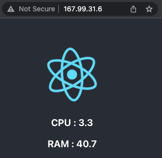

# DigitalOcean Deployment

This repository provides terraform scripts written in HashiCorp Configuration Language (HCL) for deploying a DigitalOcean VM (droplet) and installing the Docker dependencies required for deploying a reactJS application.

Follow below steps to deploy a droplet

# Generate API Key

Terraform requires DigitalOcean API key for authentication, steps to generate API key can be found [here](https://www.digitalocean.com/community/tutorials/how-to-create-a-digitalocean-space-and-api-key)

# Update Configuration

terraform.tfvars  is the configration file which contains all environment values required to deploy a cloud infrastructure. 

Update variable value in **terraform.tfvars** with api key generated above

**do_token = "694507a9ae35e3382"**

*note: ensure the api key is not push to git repository*


# Install Terraform

Terraform should be installed on the laptop/system where you plan to run this script from. Steps to install terraform is provided [here](https://www.terraform.io/cli/install/apt)

# Generate ssh key

SSH will be used to secure connection with remote droplet running on DigitalOcean. 

By running below command pair of private and public will be generated in *~/.ssh* directory

> ssh-keygen

*Note: Instructions to use existing ssh key pair is provided in droplet.tf & provider.tf*

# Deploy Droplet

After above dependency are met, clone this repository and change directory to this repo.

> cd DigitalOcean-Droplet-Terraform

## init
Process to install terraform dependency

> terraform init

## plan
Terraform will generate the action to be performed

> terraform plan

## apply
Terraform command to apply current configuration

> terraform apply

## show
environment summary can be seen by using show

> terraform show

Above command will return lot of useful information about the environment, please review it. 

**Public IP** / **droplet_floating_addr** is required for next steps, keep it handy.

# Firewall Rules

Network port access to the droplet is limited to few ports only, you can find the confiugration in [firewall.tf](https://github.com/dipinthomas/digitalocean-droplet-terraform/blob/master/firewall.tf)


# Build reactJS docker image

We will use a simple [reactJS application](https://github.com/dipinthomas/reactJS-application) to validate our deployment.

Application repository can be found [here](https://github.com/dipinthomas/reactJS-application)

Follow below step to create a docker image

## Update .env files

> clone [reactJS](https://github.com/dipinthomas/reactJS-application) git repository 

create *.env* file in the **frontend** folder. Update value for variable "REACT_APP_PROXY_HOST", with the IP address which was return in the **terraform show** command

*.env* should be as below

```
REACT_APP_PROXY_HOST=xxx.xxx.xxx.xxx <replace with droplet ip>
REACT_APP_PROXY_PORT=5000
```

## build & push

Follow the instructions provided in the repository to build & push the docker image

# Deploy Application

docker-compose in github [gist](https://gist.github.com/dipinthomas/82fb48d6ef2ad67deaf6e3d38772ec79) can be used for deploying the application. 

> wget https://gist.githubusercontent.com/dipinthomas/82fb48d6ef2ad67deaf6e3d38772ec79/raw/3df380925683a2290603034ad9e20143d96c4b2d/docker-compose.yaml

> docker-compose up -d

*note: Above docker-compose is for reference purpose only. if you are buidling your own image then the image name and tag should be updated in the compose-file, please make sure in docker-compose.yaml file is updated*

*These steps can be automated using CI/CD pipeline*


# Validation

Once the above steps are successful, you can access the application using droplet public IP address, which is found in the output of terraform commands.




